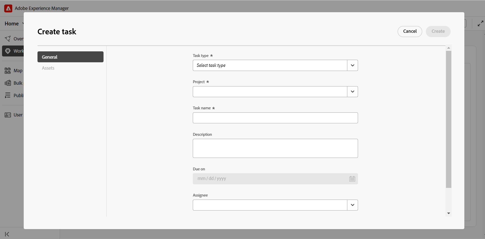
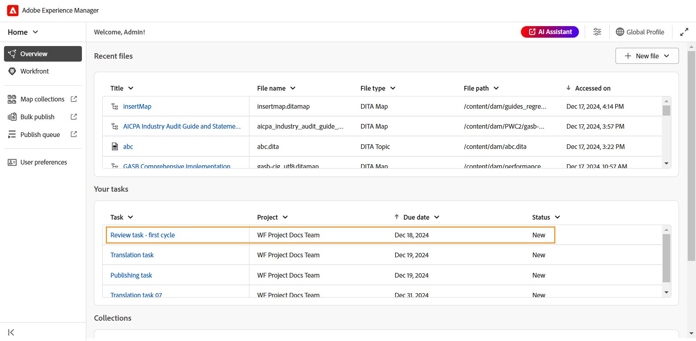

# Workfront 통합

Adobe Workfront은 팀 및 조직이 작업을 효율적으로 계획, 추적 및 관리할 수 있도록 지원하는 클라우드 기반의 작업 관리 솔루션입니다. Experience Manager Guides과 Adobe Workfront을 통합하면 Experience Manager Guides 핵심 CCMS 기능 외에도 강력한 프로젝트 관리 기능에 액세스하여 작업을 효율적으로 계획, 할당 및 추적할 수 있습니다.

이 통합을 통해 Experience Manager Guides에서 직접 Adobe Workfront 작업을 만들고 관리할 수 있습니다. 예를 들어 작성자는 Experience Manager Guides 인터페이스 내에서 직접 검토 작업(하나 이상의 DITA 주제 또는 맵이 추가됨)을 만들어 검토자에게 할당할 수 있습니다. 검토자는 Experience Manager Guides Review UI에서 할당된 작업에 대해 작업하고 주석을 포함하여 작성자에게 반환할 수 있습니다. 마찬가지로 게시 및 번역 작업을 만든 다음 이를 작업에 필요한 사용자에게 할당할 수 있습니다.

또한 이 통합을 통해 작업 대기열을 모니터링하여 모든 작업(할당된 작업)을 체계적으로 관리할 수 있습니다.

**주요 기능**

Experience Manager Guides 및 Adobe Workfront 통합을 통해 다음과 같은 작업을 수행할 수 있습니다.

* 통합되지 않은 여러 도구에 의존하지 않고 개별 작업 및 프로젝트의 진행 상황을 계획, 할당 및 추적합니다.
* 콘텐츠 작성, 검토, 게시 및 번역을 포함한 모든 Experience Manager Guides 워크플로를 보다 효율적으로 관리할 수 있습니다.
* 새 작업이 할당될 때마다 Adobe Workfront에서 이메일 알림을 수신합니다. 자세한 내용은 [알림 개요](https://experienceleague.adobe.com/ko/docs/workfront/using/basics/use-notifications/wf-notifications)를 참조하세요.
* Adobe Workfront의 직관적인 대시보드를 사용하여 프로젝트 상태를 모니터링하여 프로젝트 성능에 대한 실시간 통찰력을 제공합니다.

  Experience Manager Guides의 프로젝트 관리자를 위해 활성화된 Adobe Workfront의 강력한 프로젝트 관리 기능에 대해 알아보려면 [프로젝트 계획 개요](https://experienceleague.adobe.com/ko/docs/workfront/using/manage-work/projects/plan-a-project/plan-project)를 확인하십시오.

## 시작하기

관리자가 구성하고 활성화하면 [Experience Manager Guides 홈 페이지](./intro-home-page.md)에서 Adobe Workfront 작업에 바로 액세스할 수 있습니다.

Adobe Workfront 작업에 액세스하려면 다음 단계를 수행하십시오.

1. Experience Manager Guides에 로그인하고 **홈 페이지**&#x200B;를 엽니다.
2. 왼쪽 패널에서 **Workfront**&#x200B;을(를) 선택합니다.

   **Workfront 작업** 페이지가 표시됩니다.

   {align="left"}
3. **로그인**&#x200B;을 선택합니다.

   Adobe Workfront 로그인 페이지로 리디렉션됩니다.
4. Experience Manager Guides에서 사용된 것과 동일한 전자 메일 주소를 사용하여 로그인한 다음 **액세스 허용**&#x200B;을 선택하여 응용 프로그램이 Adobe Workfront 계정에 액세스할 수 있도록 합니다.

   Experience Manager Guides의 **Workfront 작업** 페이지로 자동 리디렉션됩니다.

   {align="left"}

## Workfront 작업 페이지에서 사용할 수 있는 기능

Workfront 작업 페이지에서 사용할 수 있는 기능은 다음과 같습니다.

* [새 작업](#create-workfront-tasks): Experience Manager Guides 인터페이스에서 바로 Adobe Workfront 작업을 만들 수 있습니다.
* [사용자에게 할당됨](#managing-tasks-assigned-to-you): 사용자에게 할당되고 아직 활성 상태인 모든 작업을 나열합니다.
* [사용자가 만든 작업](#managing-tasks-created-by-you): 만든 작업을 모두 나열하고 아직 활성 상태입니다.

Workfront 작업 페이지에는 링크 출력 아이콘 도 포함되어 있습니다. 이 아이콘을 선택하면 Adobe Workfront 프로젝트 페이지로 이동합니다. 여기에서 Adobe Workfront 계정과 매핑된 권한을 기반으로 작업 세부 사항을 보고, 댓글을 보고, 댓글을 추가하고, 다른 기능에 액세스할 수 있습니다.

자세한 내용은 [Workfront의 프로젝트, 작업 및 문제 날짜에 대한 개요](https://experienceleague.adobe.com/ko/docs/workfront/using/basics/navigate/definitions-pti-dates)를 참조하세요.

### Workfront 작업 만들기

Workfront 작업 페이지에 있는 **새 작업** 단추를 사용하여 Experience Manager Guides 인터페이스에서 직접 Adobe Workfront 작업을 만들 수 있습니다.

새 Adobe Workfront 작업을 만들려면 다음 단계를 수행하십시오.

1. Workfront 작업 페이지에서 **새 작업**&#x200B;을 선택합니다.

   **작업 만들기** 대화 상자가 표시됩니다.

   {align="left"}
2. **일반** 탭에서 다음 작업 세부 정보를 입력합니다.

   * **작업 유형**: 만들 작업 유형을 선택합니다. 사용 가능한 옵션은 **작성**, **검토**, **게시** 및 **번역**&#x200B;입니다.
   * **프로젝트**: 작업을 만들 프로젝트를 선택하십시오.
   * **작업 이름**: 작업에 대한 수사적 이름을 입력하십시오.
   * **설명**: 작업에 대한 간단한 설명을 입력하십시오.
   * **기한**: 작업 완료 기한을 설정하십시오.
   * **피할당자**: 작업에 대한 피할당자를 선택하십시오.
3. **Assets** 탭에서 **추가**&#x200B;를 선택하여 이 작업에 에셋을 추가합니다.

   {align="left"}

   **경로 선택** 대화 상자가 표시됩니다. 필요한 에셋에 대한 경로를 선택합니다. 경로 브라우저에서 유효한 경로를 선택하여 여러 자산을 추가할 수 있습니다. 선택한 경로가 유지되므로 대화 상자를 다시 열 때 쉽게 검토하거나 수정할 수 있습니다.

   * 작성, 게시 및 번역 작업의 경우 **파일 선택** 대화 상자에서 필요한 파일의 위치를 선택하라는 메시지가 표시됩니다. 선택한 파일(게시 및 번역을 위한 작성 및 맵 항목)은 **만들기** 단추를 선택하는 즉시 작업에 추가됩니다.

     {align="left"}

   * 검토 작업의 경우 먼저 에셋 유형(맵 또는 주제)을 선택하라는 메시지가 표시된 후 선택한 파일이 다음과 같이 표시됩니다.

     {align="left"}

     *검토 작업에 항목 추가*

     {align="left"}

     *리뷰 작업에 맵 추가*

     다음 작업은 검토를 위해 보내기 전에 선택 사항을 수정하는 데 사용할 수 있습니다.

      * 목록에서 일부 주제를 선택 취소합니다.
      * 문서 상태를 기반으로 주제 목록을 필터링합니다.
      * 필요에 따라 선택한 주제의 버전을 **최신 버전**, **날짜 기준 버전** 및 **기준선**(지도에만 사용 가능)으로 편집하거나 설정합니다.

     자세한 내용은 [검토할 항목 보내기](./review-send-topics-for-review.md)를 참조하십시오.

   >[!NOTE]
   >
   > 에셋을 작업에 추가하면 피할당자는 주제, 맵 또는 작업에 필요한 다른 파일에 빠르게 액세스할 수 있습니다. 작성, 게시 및 번역 작업의 경우 에셋 추가는 선택 사항이지만 워크플로 간소화에 도움이 될 수 있습니다. 그러나 검토 작업의 경우 에셋을 추가해야 합니다.

4. **만들기**&#x200B;를 선택합니다.

새 작업이 만들어지고 **사용자가 만든** 탭에 나열됩니다.

>[!NOTE]
>
> 프로젝트 관리자는 다른 주요 작업 세부 정보와 함께 Adobe Workfront 대시보드에서 새로 만든 이 작업을 볼 수 있습니다. 자세한 내용은 [대시보드 이해](https://experienceleague.adobe.com/ko/docs/workfront/using/reporting/dashboards/understand-dashboards/understand-dashboards)를 참조하세요.

### 사용자가 생성한 작업 관리

생성했으며 아직 활성 상태인 모든 작업은 Workfront 작업 페이지의 **사용자가 만든 작업** 탭에 표시되며 프로젝트 이름, 담당자, 작업 생성 날짜, 작업 완료 날짜 및 작업 상태와 같은 주요 작업 세부 정보를 제공합니다.

{align="left"}

다음 옵션은 사용자가 만든 사람 탭에 있는 작업을 마우스로 가리키면 사용할 수 있습니다.

**열기** - 

작업을 열 수 있습니다. 작업 유형에 따라 편집기, 맵 콘솔 또는 검토 UI에서 열립니다.

**편집** - 

작업을 생성하는 동안 추가된 작업 세부 정보를 편집할 수 있습니다. 작업 유형 및 프로젝트를 제외한 모든 필드를 편집할 수 있습니다. 사용자가 만든 작업만 편집할 수 있습니다. 할당된 작업은 편집할 수 없습니다.

또한 작성, 게시 또는 번역 작업을 편집할 때 에셋을 추가하거나 제거할 수 있습니다. 그러나 검토 작업의 경우 검토를 위해 전송된 에셋의 버전만 변경할 수 있습니다.

**작업 세부 정보** - 

작업 생성 중 입력한 세부 정보, 작업 상태 및 추가된 에셋을 포함한 작업 정보를 표시합니다.

### 나에게 할당된 작업 관리

사용자에게 할당되고 아직 활성 상태인 모든 작업은 Workfront 작업 페이지의 **사용자에게 할당됨** 탭에 표시되며 프로젝트 이름, 할당자, 기한 및 작업 상태와 같은 주요 작업 세부 정보를 제공합니다.

{align="left"}

다음 옵션은 사용자에게 할당됨 탭에 있는 작업을 마우스로 가리키면 사용할 수 있습니다.

**열기** - 

작업을 열 수 있습니다. 작업 유형에 따라 편집기, 맵 콘솔 또는 검토 UI에서 열립니다.

**작업 세부 정보** - 

작업 생성 중 입력한 세부 정보, 작업 상태 및 추가된 에셋을 포함한 작업 정보를 표시합니다.

{align="left"}

#### 개요 섹션에서 할당된 작업 액세스

[개요 섹션](./intro-home-page.md#overview)에서 할당된 Adobe Workfront 작업에 액세스할 수도 있습니다. 개요 섹션을 선택하면 집중하고 구성하는 데 도움이 되는 다양한 위젯이 제공됩니다.

**작업**&#x200B;은(는) 작업 이름, 관련 프로젝트, 기한 및 현재 상태 등 주요 작업 세부 정보와 함께 할당된 활성 상태인 Adobe Workfront 작업 목록이 표시되는 위젯입니다.

{align="left"}

[할당된 사용자] 탭과 마찬가지로 작업 위젯도 작업을 마우스로 가리키면 **열기**&#x200B;와 **작업 세부 정보**&#x200B;를 볼 수 있는 옵션을 제공합니다.

또한 위젯은 사용자 정의된 보기에 대해 열을 정렬하고 크기를 조정할 수 있는 옵션을 제공합니다. 열에 정렬을 적용하려면 열 헤더를 선택하고 옵션이 목록에 표시됩니다. 열의 너비를 조정하려면 헤더의 열 구분선 위로 마우스를 가져간 다음 드래그하여 크기를 조정합니다.

>[!NOTE]
>
> Experience Manager Guides 인터페이스에서 나가면 Adobe Workfront에서 새로 할당된 작업에 대한 이메일 알림을 받게 됩니다. 이러한 작업을 체크 아웃하려면 Experience Manager Guides 인스턴스에 로그인하고 할당된 작업에 액세스합니다.

## Adobe Workfront 할당 작업

Experience Manager Guides에 할당되었을 때 생성, 할당 또는 작업할 수 있는 Adobe Workfront 작업에는 네 가지 유형이 있습니다.

1. [작업 작성](#authoring-tasks)
2. [작업 검토](#review-tasks)
3. [번역 작업](#translation-tasks)
4. [작업 게시](#publishing-tasks)

다음 섹션에서는 할당된 Adobe Workfront 작업에 대한 자세한 작업 프로세스를 안내합니다.

### 작업 작성

작성 작업 시 작업하려면 다음 단계를 수행하십시오.

1. [개요](#accessing-assigned-tasks-from-overview-section) 섹션 또는 [사용자에게 할당](#managing-tasks-assigned-to-you) 탭에서 작업에 액세스합니다.

   {align="left"}

   *사용자에게 할당된 탭에서 작업 작성*

   {align="left"}

   *작업 위젯에서 작업 작성*
2. 작업할 작업 위로 마우스를 가져간 후 을(를) 선택합니다.    열려고. 작업을 선택하여 해당 작업을 열 수도 있습니다.

   모든 작성 작업이 편집기에서 열립니다.
3. **세부 정보** 탭에서 작업 세부 정보를 검토하고 **자산** 파일을 선택하여 엽니다.

   {align="left"}

4. 필요한 편집을 수행하고 **완료로 표시**&#x200B;를 선택합니다.
5. **댓글** 탭으로 전환하여 이 작업에 댓글을 추가하세요. 작업 수준에서 추가된 이러한 주석은 Adobe Workfront 프로젝트 대시보드에도 반영됩니다.

   >[!NOTE]
   >
   > 작업이 완료로 표시되면 할당된 작업 목록과 작업 개시자의 **사용자가 만든** 작업 목록 모두에서 제거됩니다.

### 작업 검토

검토자는 자신에게 할당된 Adobe Workfront 검토 작업을 검토할 수 있습니다.

자신에게 할당된 검토 작업에 대해 작업하려면 다음 단계를 수행하십시오.

1. [개요](#accessing-assigned-tasks-from-overview-section) 섹션 또는 [사용자에게 할당](#managing-tasks-assigned-to-you) 탭에서 작업에 액세스합니다.

   {align="left"}

   *사용자에게 할당된 탭에서 작업 검토*

   {align="left"}

   *작업 위젯에서 작업 작성*
2. 작업할 작업 위로 마우스를 가져간 후 을(를) 선택합니다.    열려고. 작업을 선택하여 해당 작업을 열 수도 있습니다.

   검토자의 경우 **검토 UI**&#x200B;에서 검토 작업이 열립니다.

   {align="left"}

3. 필요한 검토를 수행합니다. 항목을 검토하는 방법에 대한 자세한 내용은 [항목 검토](./review-topics.md)를 참조하십시오.
4. 검토가 완료되면 **완료로 표시**&#x200B;를 선택합니다.
5. **댓글** 탭으로 전환하여 이 작업에 댓글을 추가하세요. 작업 수준에서 추가된 이러한 주석은 Adobe Workfront 프로젝트 대시보드에도 반영됩니다.

검토자가 작업을 완료로 표시해도 작업이 완료되었음을 나타내는 것은 아닙니다. 모든 검토 작업은 작업을 만든 사용자(이상적으로는 검토를 요청한 작성자)에게 다시 할당됩니다.

>[!NOTE]
>
> 작업이 여러 검토자에게 할당된 경우 모든 검토자가 작업을 완료로 표시한 후에만 작업 작성자에게 다시 할당됩니다.

검토 통합을 위해 작성자/작성자에게 다시 할당된 검토 작업은 [개요](#accessing-assigned-tasks-from-overview-section) 섹션 또는 [사용자에게 할당됨](#managing-tasks-assigned-to-you) 탭에서 액세스할 수 있습니다.

{align="left"}

*작성자에게 다시 할당된 검토 작업*

이러한 작업의 경우 작업 유형이 **검토**(으)로 유지되는 동안 피할당자의 작업 상태가 **작성**(으)로 변경됩니다. 이 상태 변경은 모든 검토자가 검토를 완료한 경우에 발생합니다.

{align="left"}

작업 또는 열기 아이콘 을(를) 선택하면 작성자가 [검토 의견을 처리](../user-guide/review-address-review-comments.md)할 수 있는 편집기에서 작업이 열리고, 주제 버전을 업데이트하여 작업을 편집한 다음 필요한 경우 검토자에게 작업을 다시 할당할 수 있습니다.

작성자는 작업을 편집하고 다른 작성자에게 할당하여 주석을 통합하는 작업을 위임할 수도 있습니다. 이렇게 하려면 **편집**&#x200B;을 선택하고 작업 상태를 **작성**(으)로 변경한 다음 **피할당자 변경**&#x200B;을(를) 선택하십시오. 이제 목록에서 피할당자를 선택할 수 있습니다.

이 프로세스는 작업이 완전히 완료될 때까지 작성자와 검토자 사이를 왕복하는 연속 사이클을 형성합니다. 제안된 변경 사항이 모두 통합되면 작성자는 **완료 표시**&#x200B;를 선택하여 작업을 완료할 수 있습니다.

### 번역 작업

자신에게 할당된 Adobe Workfront 번역 작업에 대해 다양한 번역 작업을 수행할 수 있습니다.

번역 작업을 수행하려면 다음 단계를 수행하십시오.

1. [개요](#accessing-assigned-tasks-from-overview-section) 섹션 또는 [사용자에게 할당](#managing-tasks-assigned-to-you) 탭에서 작업에 액세스합니다.

   {align="left"}

   *사용자에게 할당 탭의 번역 작업*

   {align="left"}

   *작업 위젯의 번역 작업*

2. 작업할 작업 위로 마우스를 가져간 후 을(를) 선택합니다.    **맵 콘솔**&#x200B;에서 엽니다. 작업을 선택하여 해당 작업을 열 수도 있습니다.
3. 작업 세부 정보 및 번역을 위해 추가된 파일을 검토합니다.

   {align="left"}
4. 다양한 번역 옵션을 보려면 **번역** 탭으로 이동합니다. Experience Manager Guides에서 [콘텐츠를 번역](../user-guide/translation.md)하는 방법에 대해 알아봅니다.
5. 필요한 번역을 수행하고 **번역용으로 보내기**&#x200B;를 선택합니다.
   {align="left"}
6. **Workfront** 섹션으로 이동한 다음 **완료로 표시**&#x200B;를 선택하여 작업이 완료되었음을 나타냅니다.
7. **댓글** 탭으로 전환하여 이 작업에 댓글을 추가하세요. 작업 수준에서 추가된 이러한 주석은 Adobe Workfront 프로젝트 대시보드에 반영됩니다.

   >[!NOTE]
   >
   > 작업이 완료로 표시되면 할당된 작업 목록과 작업 개시자의 **사용자가 만든** 작업 목록 모두에서 제거됩니다.

### 작업 게시

게시자는 세부 정보를 보고 자신에게 할당된 게시 작업을 게시할 수 있습니다.

게시 작업 시 작업하려면 다음 단계를 수행하십시오.

1. [개요](#accessing-assigned-tasks-from-overview-section) 섹션 또는 [사용자에게 할당](#managing-tasks-assigned-to-you) 탭에서 작업에 액세스합니다.

   {align="left"}

   *사용자에게 할당된 탭에서 작업을 게시하는 중*

   {align="left"}

   *작업 위젯에서 작업 게시*
2. 작업할 작업 위로 마우스를 가져간 후 을(를) 선택합니다.    **맵 콘솔**&#x200B;에서 엽니다. 작업을 선택하여 해당 작업을 열 수도 있습니다.
3. 작업 세부 사항 및 게시를 위해 추가된 파일을 검토합니다.

   {align="left"}
4. **출력 사전 설정**(으)로 이동하여 작업을 게시하는 데 필요한 게시 작업을 수행합니다. 자세한 내용은 [출력 사전 설정 이해](../user-guide/generate-output-understand-presets.md)를 참조하십시오.
5. 게시가 완료되면 **Workfront** 섹션으로 이동한 다음 **완료로 표시**&#x200B;를 선택하여 작업이 완료되었음을 나타냅니다.
6. **댓글** 탭으로 전환하여 이 작업에 댓글을 추가하세요. 작업 수준에서 추가된 이러한 주석은 Workfront의 프로젝트 대시보드에 반영됩니다.

   >[!NOTE]
   >
   > 작업이 완료로 표시되면 할당된 작업 목록과 작업 개시자의 **사용자가 만든** 작업 목록 모두에서 제거됩니다.
